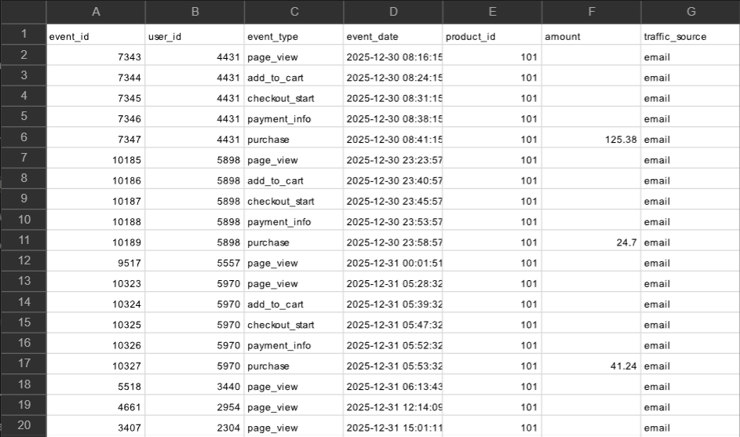
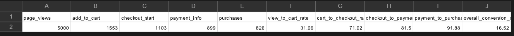
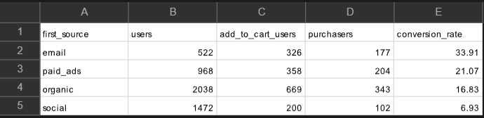

# E-commerce Funnel Analysis (SQL / BigQuery)

## Project Overview

This project analyzes an e-commerce user event dataset using SQL in Google BigQuery.  

The goal is to understand where customers drop off before purchase and what actions the business should take.

## Dataset

The dataset includes the following fields:

- `event_id`
- `user_id`
- `event_type`
- `event_date`
- `product_id`
- `amount`
- `traffic_source`

Events in the dataset represent key steps in the shopping journey:

- page_view
- add_to_cart
- checkout_start
- payment_info
- purchase

Preview of the dataset (first 20 rows from BigQuery):

## Business Questions

This analysis focuses on answering the following questions:

1. How many users reach each stage of the purchase funnel?
2. Where does the largest drop-off occur?
3. Which traffic sources generate the best conversions?
4. Which products generate the most revenue?

## Tools Used

- SQL
- Google BigQuery

## Results (BigQuery)

Screenshots of query results from Google BigQuery:

| Funnel conversion rates | Traffic source performance |
|-------------------------|----------------------------|
|  |  |

| Revenue by traffic source |
|---------------------------|
|  |

---

## Key Findings

- Overall conversion from page view to purchase was 16.52%.
- The largest drop-off occurs between **product view and add to cart**, only 31% of users who view a product add it to cart.
- Email traffic has the **highest conversion rate** (33.91%).
- Social traffic brings users but converts significantly lower (6.9%).
- Organic traffic drives the **most overall revenue** due to higher volume (42.37% of total revenue).

## Recommendation

- Improve product pages (design and info) and add-to-cart UX to increase add-to-cart rate.
- Scale or optimize email as a high-intent channel.
- Reassess social traffic quality and targeting.

## Project Files

- `queries.sql` – SQL queries used for the analysis
- `insights.md` – summary of findings and recommendations
- `images/` – BigQuery result screenshots

## Author

SQL portfolio project created as part of my data analytics practice.
Dataset is shared by Lore So What.
